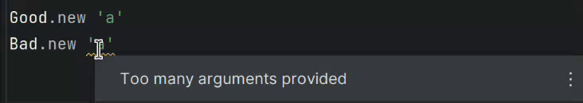

The code in this repo demonstrates a [bug](https://youtrack.jetbrains.com/issue/RUBY-34849/Class-method-from-extended-module-breaks) in JetBrains RubyMine.

`lib/foo.rb` contains two classes, each of which uses a helper method to declare attributes
and a matching `initialize` method. The only difference between the classes is that `Bad`'s
helper lives in a separate module (which `Bad` `extend`s), while `Good` has the same helper
as an own class method.

Both classes have identical, correct RBS signatures. Then again, I'm not even sure the root problem is
RBS support.

The problem is that RubyMine ignores `Bad#initialize`'s signature entirely (falling back on
`BasicObject#initialize`), and therefore reports warnings:

